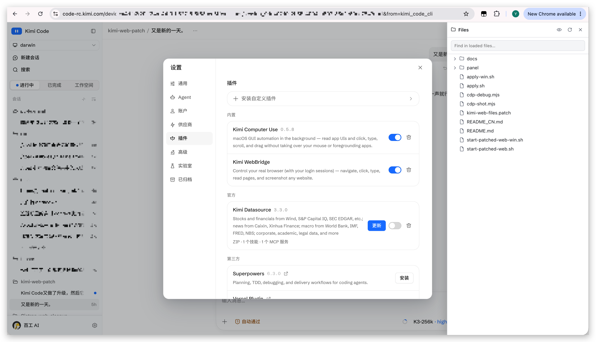
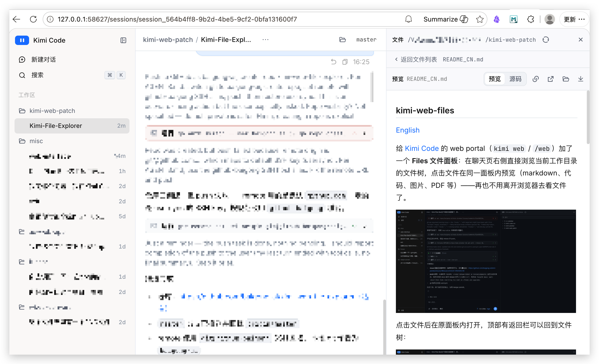

# kimi-web-files

[English](README.md)

给 [Kimi Code](https://github.com/MoonshotAI/kimi-code) 的 web portal（`kimi web` / `/web`）加了一个 **Files 文件面板**：在聊天页右侧直接浏览当前工作目录的文件树，点击文件在同一面板内预览（markdown、代码、图片、PDF 等）——再也不用离开浏览器去看文件了。



点击文件后在原面板内打开，顶部有返回栏可以回到文件树：



## 为什么做这个

Kimi Code 的 web 界面很适合长会话，但它看不到工作目录——想确认一个文件就得切到终端、编辑器或访达。研究之后发现缺的其实很少：服务端本来就提供完整的文件 API（`fs:list` / `fs:read`，带 git 状态），web 前端也有现成的文件预览组件和右侧面板体系，上游甚至预留了空的 `fileTree` i18n 占位。kimi-web-files 把这些现成的零件组装成了 portal 缺失的文件树。

## 实现原理

### 官方 web UI 的"图纸"与"成品"

Kimi Code 的 web UI 是开源的，源码在 [MoonshotAI/kimi-code](https://github.com/MoonshotAI/kimi-code) 的 `apps/kimi-web` 目录（Vue 3 + TypeScript + Vite）。但 `kimi` 二进制里内置的**不是**这套源码，而是它的构建产物：经过 Vite 压缩混淆、以 hash 命名的静态 bundle（`index-XXX.js` 之类），内嵌在单文件二进制（Node SEA）里。每次启动 `kimi web`，二进制都会把这些内嵌资源解压到缓存目录，并逐文件校验 sha256：

```
~/Library/Caches/kimi-code/web/<版本>/<平台>/<manifest 哈希>/dist-web
```

运行中的 server 做的事情很简单：把这个目录里的静态文件发给浏览器，同时提供前端调用的 REST/WS API。

所以两者的关系是：**二进制里的 web 代码 = 官方源码编译后的成品**。直接在解压出来的 bundle 上加功能是不现实的（压缩混淆过的代码没法开发，而且 sha256 校验也会把改动还原）——唯一合理的工作面是源码。

### 本项目的做法

```
MoonshotAI/kimi-code（apps/kimi-web 源码）
        │
        ├─ 官方构建 ──► 内嵌进 kimi 二进制 ──► 启动时解压到 dist-web ──► 伺服（官方界面）
        │
        └─ git apply kimi-web-files.patch
                │
                pnpm build（与官方相同的 Vite 工具链）
                │
                dist/  =  官方 web UI + Files 面板（约 99% 相同，+715 行）
                │
                apply.sh：把 dist/ rsync 到【运行中】server 的 dist-web
                │
                ► server 开始伺服补丁版界面，直到进程结束
```

1. 克隆官方源码，`git apply` 打上 `kimi-web-files.patch`——整个功能就是一个干净的 diff（2 个新文件 + 11 处小接线）。
2. 用和官方相同的工具链构建。得到的 `dist/` 是**完整**的 web UI——官方版加上 Files 面板。
3. `apply.sh` 把这份构建产物整体替换到运行中 server 的资源缓存目录。时机是关键：二进制在**每次启动时**都会重新解压（即还原）官方资源，但运行中的 server 是按请求从磁盘读文件的。所以补丁必须在 server 启动**之后**应用。注意同一个版本的所有 `kimi web` 进程共享同一个缓存目录——补丁对所有同版本 portal 同时生效，也会被任何一次新的 `kimi web` 启动一并还原（`start-patched-web.sh` 的看门狗会发现并自动重打）。

server 端完全无感——它只是把缓存目录里现有的静态文件发出去，并照常提供同一套稳定的、会话作用域的 fs API。

### 安全性从哪来

- **不修改任何持久的东西**。`kimi` 二进制、`~/.kimi-code`、二进制内嵌的官方资源都不会被碰。被改动的只有一个缓存目录的内容——而这个目录在二进制眼里本来就是一次性的。
- **回滚是自动且必然的**——这是优点。每次启动时 sha256 校验 + 重新解压的机制意味着：只要不带补丁重启一次 `kimi web`，就必定回到 100% 官方界面。这个补丁不可能"弄坏"你的安装，重启即撤销。
- **影响范围只是一个浏览器页面**。补丁改变的只是本地 server 发给浏览器的静态文件。不增加任何服务端路由、不提升任何权限、不产生任何超出现有同源 API 的网络请求。

## 功能

- 会话工作目录的文件树，目录点击时才懒加载
- Find 过滤框按文件名筛选；有 git 改动的条目带标记点
- 面板头部的隐藏文件开关（眼睛图标）：`.gitignore` 这类点开头文件默认隐藏，点一下即可列出，走服务端的 `show_hidden` 列表选项
- 面板内预览复用官方 FilePreview 组件：markdown 渲染、代码高亮、图片、PDF、CSV 等，支持下载 / 在编辑器打开 / 在访达中显示
- 中英文界面（跟随 portal 的语言设置）
- 完全遵循 portal 自身规范：右侧详情面板层、Esc 关闭、切换会话自动重置

## 安装

环境要求：Node.js ≥ 24.15、pnpm 10（与 kimi-code 本体一致），macOS、Linux，或 Windows（通过 Git Bash，使用 `*-win.sh` 脚本，感谢 [@chulongYang](https://github.com/chulongYang)）。

```bash
# 1. 克隆官方源码并检出 web UI 代码。
#    注意：上游从 0.32.0 起把 apps/kimi-web 从 main 分支移除了，
#    直接 clone main 已经拿不到 web 源码。需要固定到最后一个
#    还包含它的 commit：
git clone --depth 1 --filter=blob:none --no-checkout https://github.com/MoonshotAI/kimi-code.git kimi-code-src
cd kimi-code-src
git fetch --depth 1 origin 21185447fe0f04dbe342bebb6c6d0b364fd43daa
git checkout FETCH_HEAD

# 2. 应用功能补丁
git apply /path/to/kimi-web-files/kimi-web-files.patch

# 3. 构建 web 前端（install 约 2 分钟，build 约 20 秒）
pnpm install
pnpm --filter @moonshot-ai/kimi-web build
```

**兼容性**：构建基于最后公开的 web UI 源码（0.31 时期），已实测在 Kimi Code server **0.31.x、0.32.0、0.34.0、0.35.0 和 0.36.0** 上都能正常工作——它用到的会话级 fs API（`fs:list` / `fs:read`）在这些版本间是稳定的。

**已知代价：界面漂移。** 补丁生效期间 portal 伺服的是 0.31 时期的 UI 构建。早期这只意味着*看不到*官方新加的界面功能；到 0.36 漂移已经*肉眼可见*，比如账号菜单里会显示官方现行界面已经移除的条目。这是整体替换界面方案的固有问题，而且会随着每次官方发版继续扩大。靠重做补丁解决不了：上游已不再公开 web UI 源码（0.32.0 起只发布编译混淆后的产物，现在直接跟踪在 `apps/kimi-code/dist-web`）。想看官方现行界面，不带补丁重启一次 `kimi web` 即可还原。如果未来某个 server 版本破坏了 fs API 兼容性，在上游重新公开 web 源码之前，本项目无法跟进。

脚本约定的目录结构如下（两个仓库在**同一个父文件夹**下）：

```
某个文件夹/
├── kimi-code-src/     官方源码克隆（已 git apply + build）
└── kimi-web-files/    本仓库
```

之所以要求"放一起"，是因为 `apply.sh` 默认按相对路径 `<本仓库>/../kimi-code-src/apps/kimi-web/dist` 找构建产物。目录结构不同也能用，显式指定即可：`KIMI_WEB_DIST=/路径/kimi-web/dist ./apply.sh`。

**Windows：** 请改用 Git Bash 移植版 `apply-win.sh` / `start-patched-web-win.sh`（缓存目录取 `%LOCALAPPDATA%\kimi-code\web`，用 `cp` 代替 `rsync`，浏览器用 `cmd /c start` 打开）。一个坑：`core.autocrlf=true` 时 `.patch` 文件会被签出成 CRLF，导致 `git apply` 全部不匹配——先执行一次 `sed -i 's/\r$//' kimi-web-files.patch`（可选补丁同理）再应用。

## 使用

```bash
# 方式一（推荐）：启动 portal，就绪后自动打补丁，补丁完成后才打开浏览器
./start-patched-web.sh

# 方式二：portal 已经在跑（`kimi web` 或 TUI 里的 `/web`），直接补一次
./apply.sh
```

然后点聊天页 header 右侧新增的文件夹图标即可。`start-patched-web.sh` 会在补丁完整落地**之后**才打开浏览器，并在 URL 上加时间戳参数，强制浏览器重新拉取入口 HTML——kimi server 不发任何缓存头，Safari 会启发式缓存旧入口，可能引用到已被替换掉的 bundle，表现为白屏。如果个别情况下还是白屏，硬刷新（Cmd+Shift+R）一次即可。

**想用原版 portal？直接用就行，不需要任何还原操作。** 本项目没有任何东西会自动运行：`apply.sh` 只在你手动执行时（或 `start-patched-web.sh` 内置看门狗调用时）才会跑，绝不会 hook 进 `kimi web` 的启动流程。所以想用官方界面时，照常用 `kimi web` 或 TUI 里的 `/web` 启动即可。`kimi` 二进制每次启动都会把内嵌的官方资源按 sha256 校验重新解压到缓存目录，这意味着两件事：你拿到的 portal 是 100% 官方的，而且这次启动本身就会把共享缓存目录里的补丁覆盖掉。没有需要卸载的东西，也没有任何残留。之后想再用 Files 面板，重跑一次 `./apply.sh`（或用 `start-patched-web.sh` 启动）就行。

**同时开多个 portal 时要注意**：同一个版本的 `kimi web` 共享同一个 dist-web 缓存目录——不管是 `kimi web`、`start-patched-web.sh` 还是 TUI 里的 `/web` 启动的。这带来两个直接推论：

- 补丁打上之后，**所有**正在运行的同版本 portal 立刻都带 Files 面板（包括 `/web` 打开的那个），不需要每个单独补。
- 任何一次新的 `kimi web` 启动都会重新解压官方资源、把补丁覆盖掉，**所有**同版本 portal 会一起回到官方界面。为此 `start-patched-web.sh` 内置了看门狗：它运行期间每 3 秒检查一次，发现补丁被覆盖就自动重打。如果你没用它，被覆盖后手动重跑一次 `apply.sh` 即可。

**补丁的存续**：补丁效果维持到"被某次 `kimi web` 启动覆盖"为止。单独用 `/web` 打开一个 portal 是看不到 Files 面板的（那次启动本身就是一次还原）；但只要补丁处于生效状态，`/web` 打开的 portal 同样带面板。

**Kimi Code 升级后**：新版本会解压出新的缓存目录，portal 自动回到官方版。重新构建（如果上游 web 前端有改动，先重新 clone 并 `git apply`），然后再跑 `apply.sh` / `start-patched-web.sh` 即可。

## 文件

| 文件 | 说明 |
|---|---|
| `kimi-web-files.patch` | 功能本体：针对 MoonshotAI/kimi-code 中 `apps/kimi-web` 的 git 补丁（2 个新文件、11 个文件接线，约 100 行接线 + 新的树/面板组件） |
| `apply.sh` | 把构建产物同步到运行中 server 的资源缓存 |
| `apply-win.sh` | `apply.sh` 的 Windows（Git Bash）移植版——缓存目录取 `%LOCALAPPDATA%`，用 `cp` 代替 `rsync` |
| `start-patched-web.sh` | `kimi web` 包装器：等 server 监听端口后自动执行 `apply.sh`，并带看门狗——补丁被其他 `kimi web` 启动覆盖时自动重打 |
| `start-patched-web-win.sh` | `start-patched-web.sh` 的 Windows（Git Bash）移植版——`curl` 探测就绪、`cmd /c start` 打开浏览器 |
| `cdp-shot.mjs` | 开发工具：通过 CDP 驱动 headless Chrome，端到端截图验证面板 |
| `docs/` | 截图 |

## 更新记录

- **v0.36.0** — 在 Kimi Code 0.36.0 上验证通过，补丁无需改动。README 补充了界面漂移的说明（伺服 0.31 时期界面带来的可见差异，如账号菜单残留条目）。
- **v0.35.0** — 在 Kimi Code 0.35.0 上端到端验证通过（面板、目录展开、文件预览、隐藏文件开关均确认）；补丁无需改动。
- **v0.34.1** — 面板头部新增隐藏文件开关（眼睛图标）：点开头文件默认隐藏，点一下即可通过服务端 `show_hidden` 选项列出。已在 Kimi Code 0.34.0 上实测。
- **v0.34.0** — 在 Kimi Code 0.34.0 上验证通过；新增 Windows（Git Bash）脚本（感谢 [@chulongYang](https://github.com/chulongYang)）。
- **v0.32.0** — 首个跟踪版本：Files 面板，在 0.31.x / 0.32.0 上验证通过。

## 开发

```bash
cd kimi-code-src
pnpm --filter @moonshot-ai/kimi-web run typecheck   # vue-tsc
pnpm --filter @moonshot-ai/kimi-web build           # 改动后重新构建
# 重新生成可分发的补丁：
git diff HEAD -- apps/kimi-web > /path/to/kimi-web-files/kimi-web-files.patch
```

已在 macOS（arm64）上用 Kimi Code 0.31.x 到 0.36.0 验证。功能完全自包含在 web 前端内，只调用稳定的、会话作用域的服务端 API，跟随上游升级应该比较省心；万一某次升级导致 `git apply` 冲突，也会是小范围的局部冲突。

## License

MIT。补丁目标是同样 MIT 许可的 [MoonshotAI/kimi-code](https://github.com/MoonshotAI/kimi-code)。本项目与 Moonshot AI 无隶属关系。
