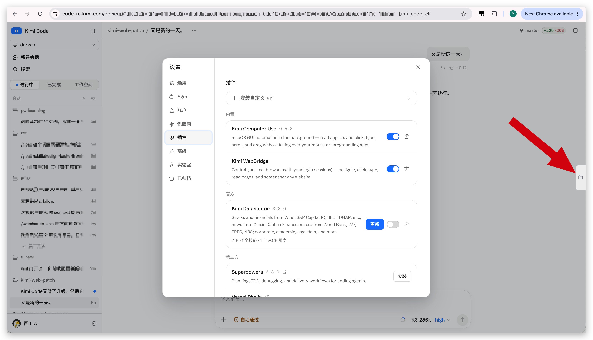

# kimi-web-files

[English](README.md)

给 [Kimi Code](https://github.com/MoonshotAI/kimi-code) 的 web portal（`kimi web` / `/web`）加了一个 **Files 文件面板**：在聊天页里直接浏览当前工作目录的文件树，点击文件在同一面板内预览（markdown、代码、图片、PDF 等），不用离开浏览器去看文件。

Files 页签就在官方原版 UI 的窗口右边缘（红色箭头处），图中同时打开了设置里的官方插件面板，两者互不影响：



点开页签即可浏览当前工作目录的文件树：


点击文件后在原面板内打开，顶部有返回栏可以回到文件树：


与"整包替换 UI"的做法不同，本项目把面板**注入到官方原版 UI 之上**：设置、插件面板、单条消息激活多个技能等所有官方功能，始终保持你当前安装的 Kimi Code 版本。

## 为什么

Kimi Code 的 web UI 很适合长时间会话，但没法直接看工作目录：查个文件就要切到终端、编辑器或访达。其实 server 本身已经提供了完整的文件系统 API（`fs:list` / `fs:read`，带 git 状态），缺的只是一个前端。kimi-web-files 用一个自包含的小面板补上这一块，且完全不改动官方 UI 代码。

## 工作原理

`kimi` 单文件二进制里内嵌的是编译后的 web UI（压缩混淆过的静态 bundle）。每次启动 `kimi web` 时，二进制会把这些内嵌资源按 sha256 校验重新解压到缓存目录：

```
~/Library/Caches/kimi-code/web/<version>/<platform>/<manifest-hash>/dist-web
```

运行中的 server 直接从这个目录读静态文件，同时提供 UI 调用的 REST/WS API。

`apply.sh` 在**官方资源之上**叠加文件面板：

```
dist-web/
├── assets/
│   ├── index-XXX.js …        ← 官方 bundle，原样不动
│   ├── kimi-files-panel.js   ← 拷入（面板本体，一个自包含脚本）
│   └── kimi-files-panel.css  ← 拷入
└── index.html                ← 只加一行 <link> 和一行 <script defer>
```

- **不改、不替换任何官方文件。** 两个面板文件是纯粹的新增；`index.html` 只多两行。你拿到的门户就是你安装版本的 100% 官方 UI，只是窗口右边缘多了一个文件页签。Kimi Code 的新功能（设置里的插件面板、一条消息激活多个技能、以及以后发布的任何功能）在注入面板期间全部照常工作，因为应用代码逐字节都是官方的。
- **没有构建步骤，不需要克隆源码。** 面板是手写的零依赖原生 JS 应用（约 1000 行），用与官方 UI 相同的 Bearer 凭证调用 server 稳定的会话级 fs REST API（`POST /api/v1/sessions/{id}/fs:list` 等）。安装只需要克隆本仓库。
- **与缓存补丁相同的启动时序规则。** 二进制在**每次启动**时重新解压并还原官方 `index.html`，但运行中的 server 按请求从磁盘读文件。所以注入必须在 server 启动**之后**进行。同版本的所有 `kimi web` 进程共享一个缓存目录：注入对所有同版本门户同时生效，而任何一次新的 `kimi web` 启动都会把注入整体还原（`start-patched-web.sh` 的看门狗会检测到并自动重新注入）。

### 安全性从何而来

- **不修改任何持久内容。** `kimi` 二进制、`~/.kimi-code`、二进制内嵌的官方资源都不动。改的只是二进制认为可随时丢弃的缓存目录内容。
- **回滚是自动的。** 每次启动时的 sha256 校验重解压意味着，直接重启 `kimi web` 就会恢复 100% 官方入口页。这个项目不可能弄坏你的安装，重启即还原。
- **影响范围只有一个浏览器页面。** 注入只改变本地 server 递给浏览器的静态文件，不新增 server 路由，不提权，不发起到既有同源 API 之外的网络请求。

## 功能

- 会话工作区根目录的文件树，目录展开时按需懒加载
- `Find` 输入框按名称过滤已加载的文件；有改动的条目带 git 标记
- 隐藏文件开关（面板头部的眼睛按钮）：默认不显示点开头文件，点一下即列出，走的是 server 的 `show_hidden` 选项
- 面板内预览：渲染后的 markdown（可切源码）、带行号的代码和文本、图片、PDF、CSV 表格；附下载、在编辑器打开、在访达中显示操作
- 跟随门户的语言（中/英）和明暗主题
- 右边缘悬浮页签；覆盖式面板，宽度可拖拽；`Esc` 先关预览再关面板；切换会话时状态自动重置
- 支持 **Remote Control**（`kimi rc` / `kimi web --remote-control`）：面板复刻了中继的 server origin 覆盖逻辑（`?kimi_origin=` / `sessionStorage['kimi-desktop-server-origin']`），API 调用经隧道正确回到你的机器

与深度集成 UI 相比的已知限制：代码预览没有语法高亮（等宽字体加行号）；markdown 文档里的相对路径图片不渲染。

## 安装

要求：macOS、Linux，或 Windows（Git Bash，用 `*-win.sh` 脚本）。不需要 Node.js，不需要 pnpm，不需要源码检出。

```bash
git clone https://github.com/<your-fork>/kimi-web-files.git
cd kimi-web-files
```

## 使用

```bash
# 方式 A（推荐）：启动门户，就绪后自动注入，然后才打开浏览器
./start-patched-web.sh

# 方式 B：门户已经在运行（`kimi web` 或 TUI 里的 `/web`），
# 直接向运行中的 server 注入
./apply.sh
```

然后点击窗口右边缘新出现的文件页签。`start-patched-web.sh` 只在注入完成后才打开浏览器，并在 URL 上加时间戳查询串，强制浏览器重新拉取入口 HTML（kimi server 不发缓存头，浏览器可能会启发式缓存旧入口页）。如果偶尔遇到旧页面，强制刷新一次（Cmd+Shift+R）即可。

**Remote Control（kimi ≥ 0.39，实验性）：** 通过包装脚本启动，让注入在 server（及其隧道）就绪后落地：

```bash
KIMI_CODE_EXPERIMENTAL_REMOTE_CONTROL=1 ./start-patched-web.sh --remote-control
```

如果已有 `kimi rc` 在跑，执行一次 `./apply.sh` 即可（隧道服务的就是共享缓存目录的内容）。然后打开 `code-rc.kimi.com` 链接（或扫码），用 Kimi 账号登录。

**想用纯官方门户？直接用就行，没有需要卸载的东西。** 本项目没有任何自启动行为：`apply.sh` 只在你手动调用时执行（或由 `start-patched-web.sh` 的看门狗调用）。想要官方门户就按平常方式启动：`kimi web` 或 TUI 里的 `/web`。每次启动时 `kimi` 二进制都会重新解压经过 sha256 校验的官方 `index.html`，注入随之移除。没有需要卸载的东西，也没有残留。

**同时跑多个门户：** 同版本的所有 `kimi web` 进程共享一个 dist-web 缓存目录。两个直接推论：

- 一旦注入，**所有**正在运行的同版本门户立刻都有文件面板（包括用 `/web` 打开的），无需逐个注入。
- 任何一次新的 `kimi web` 启动都会重新解压官方资源，把**所有**门户的注入移除。`start-patched-web.sh` 内置看门狗：运行期间每 3 秒检查一次，被移除就自动重新注入。没有看门狗时，在这种启动之后再跑一次 `apply.sh` 即可。

**Kimi Code 升级之后：** 新版本会解压出新的缓存目录，门户自动回到官方原版。再跑一次 `apply.sh` / `start-patched-web.sh` 即可，不需要重新构建或下载。面板只依赖稳定的会话级 fs REST API，因此能紧跟上游版本。如果未来某个版本改动了这些 API，面板会显示错误，门户其余功能不受影响。

## 旧模式：源码补丁

0.40.1 之前，本项目走的是另一条路：从最后一份公开源码（0.31 时代）整体重建 web UI 并集成面板，然后替换 server 的全部静态资源。那样集成度更高（复用官方 FilePreview 组件和右侧详情层），但整个 UI 被冻结在 0.31：打补丁期间没有官方新功能（如 0.40.0 加进设置的插件面板），而且上游从 0.33.0 起已不再发布 web UI 源码。

旧的 `kimi-web-files.patch` 保留在仓库里供参考。日常使用请用上面的注入模式；源码补丁流程（克隆 `kimi-code-src`、pnpm 构建、`KIMI_WEB_DIST=...`）已不再需要。

## 文件说明

| 文件 | 说明 |
|---|---|
| `panel/kimi-files-panel.js` | 面板本体：一个自包含的原生 JS 脚本（目录树、预览、markdown 渲染、i18n、主题），注入到官方门户 |
| `panel/kimi-files-panel.css` | 面板样式，`.kfp-` 前缀隔离，明暗双主题 |
| `apply.sh` | 把两个面板文件拷进运行中 server 的资源缓存，并往 `index.html` 加 `<link>` / `<script>` 标签 |
| `apply-win.sh` | `apply.sh` 的 Windows（Git Bash）移植：缓存位于 `%LOCALAPPDATA%`，使用 GNU sed/stat |
| `start-patched-web.sh` | `kimi web` 包装脚本：等 server 就绪后执行 `apply.sh`，然后看门狗值守，注入被其他 `kimi web` 启动覆盖时自动重打 |
| `start-patched-web-win.sh` | `start-patched-web.sh` 的 Windows（Git Bash）移植 |
| `kimi-web-files.patch` | 旧模式：针对 `apps/kimi-web` 的整包源码补丁（保留供参考，注入模式不需要） |
| `cdp-shot.mjs` | 开发工具：通过 CDP 驱动无头 Chrome 对面板做端到端截图 |
| `docs/` | 截图 |

## 更新记录

- **v0.40.1** — **重写为注入官方原版 UI**，不再整包替换。门户自身代码完全不动，因此当前和未来的官方功能（设置里的插件面板、一条消息激活多个技能，均为 0.40.0 新增）在文件面板启用期间照常工作，UI 漂移问题彻底消失。面板改为自包含的原生 JS 应用（`panel/kimi-files-panel.js` + `.css`），自带预览渲染器；安装不再需要 Node/pnpm 和 kimi-code 源码克隆。已在 Kimi Code 0.40.1 上验证：文件树、懒加载展开、markdown/代码/图片预览、隐藏文件开关、git 标记，以及官方插件面板并存。注意：设置对话框的形态取决于会话后端，完整版（含插件页签）在默认的 v2 后端下显示。
- **v0.39.1** — 在 Kimi Code 0.39.1 上验证通过。一处 wire 变更曾破坏登录门禁：0.39.1 把 `GET /auth` 的就绪标志从 `ready` 改名为 `models_ready`，导致补丁版 UI 把 `ready: undefined` 当成"未登录"，OAuth 授权成功后仍停留在登录页。`getAuth()` 现在两种格式都接受。
- **v0.39.0** — 在 Kimi Code 0.39.0 上验证通过，包括 **Remote Control** 端到端（`kimi rc`、远程浏览器连接、文件面板经隧道可用）。补丁把中继的 server origin 覆盖逻辑（`?kimi_origin=` / `sessionStorage['kimi-desktop-server-origin']`）回移植到了前端 API 配置中。脚本修复：`apply.sh` / `apply-win.sh` 同步后 `touch` 入口 HTML（rsync/cp 保留源文件 mtime，会让补丁版 `index.html` 比浏览器缓存的官方版更旧而被回 304）；`start-patched-web*.sh` 在 URL 已有查询串时改用 `&` 拼接时间戳（RC 跳转链接就是如此），修掉了把链接搞坏的双 `?` 问题。
- **v0.37.2** — 在 Kimi Code 0.37.2 上验证通过（面板、目录展开、预览、隐藏文件开关均端到端确认）；补丁无改动。当时上游仍没有原生文件树/文件面板（0.37.0 侧栏的 Open/Done/Workspaces 页签是会话管理，不是文件浏览器）。
- **v0.36.0** — 在 Kimi Code 0.36.0 上验证通过；补丁无改动。记录了提供 0.31 时代 UI 构建带来的可见 UI 漂移（账户菜单里的过期条目）。
- **v0.35.0** — 在 Kimi Code 0.35.0 上验证通过；补丁无改动。
- **v0.34.1** — 隐藏文件开关（面板头部的眼睛按钮）：默认不显示点开头文件，点一下经 server 的 `show_hidden` 选项列出。已在 Kimi Code 0.34.0 上验证。
- **v0.34.0** — 在 Kimi Code 0.34.0 上验证通过；新增 Windows（Git Bash）脚本（感谢 [@chulongYang](https://github.com/chulongYang)）。
- **v0.32.0** — 首个有记录的版本：文件面板，在 0.31.x / 0.32.0 上验证通过。

## 开发

面板没有构建步骤：编辑 `panel/kimi-files-panel.js` / `.css`，重跑 `./apply.sh`（它会按内容哈希给脚本 URL 加版本号），然后强制刷新门户页面。请保持零依赖，所有样式和全局标识都放在 `kfp-` 前缀下。

旧的源码补丁仍可基于其基准提交重新生成（如有需要）：

```bash
cd kimi-code-src
git diff 21185447fe0f04dbe342bebb6c6d0b364fd43daa -- apps/kimi-web > /path/to/kimi-web-files/kimi-web-files.patch
```

## 许可证

MIT。与 Moonshot AI 无隶属关系。
